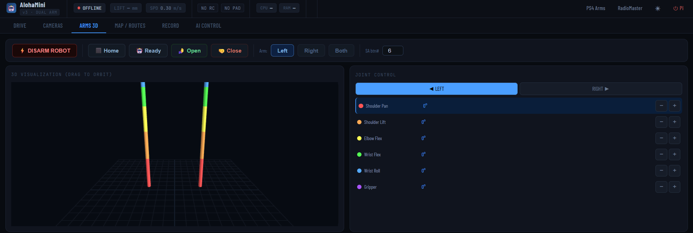
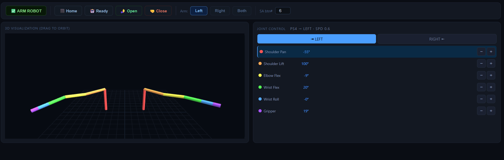
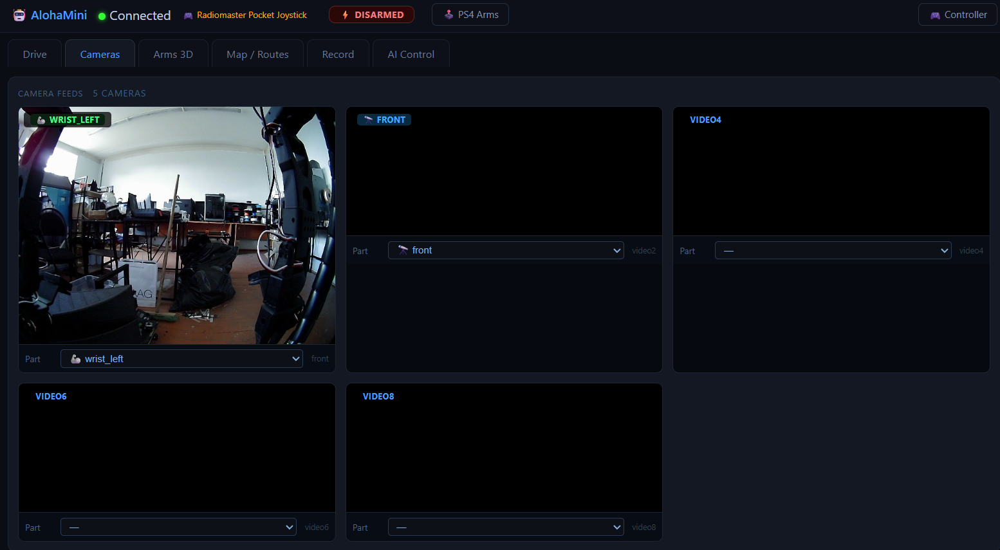
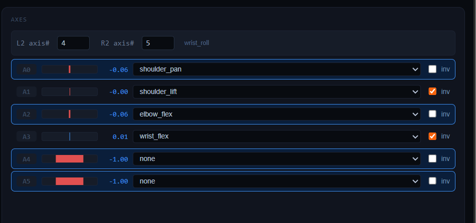

<div align="center">

# AlohaMini

**Dual-arm mobile robot with lift — built from scratch on [LeRobot](https://github.com/huggingface/lerobot)**

**Двурукий мобильный робот с лифтом — собран с нуля на [LeRobot](https://github.com/huggingface/lerobot)**

[](https://python.org)
[](https://github.com/liyiteng/lerobot_alohamini)
[](https://www.raspberrypi.com)

</div>

---

## Overview / О проекте

**EN:** AlohaMini is a compact dual-arm mobile robot — 2× SO-101 6-DOF arms, 3-wheel omni base, motorized lift, and 5 cameras — running on Raspberry Pi 5 with HuggingFace LeRobot for imitation learning.

**RU:** AlohaMini — компактный двурукий мобильный робот: 2× SO-101 (6 степеней свободы), голономная 3-колёсная база, лифт и 5 камер на Raspberry Pi 5. Управление с геймпада, веб-интерфейс, запись датасетов и обучение политик через LeRobot.

---

## Screenshots / Скриншоты

| Arms 3D (disarmed / выключен) | Arms 3D (teleoperated / управление) |
|---|---|
|  |  |

| Camera feeds / Камеры | Gamepad binding / Биндинг осей |
|---|---|
|  |  |

---

## Hardware / Железо

| Component | Qty | Notes |
|-----------|-----|-------|
| Raspberry Pi 5 (8GB) | 1 | Robot host — `lekiwi_host` |
| Feetech STS3215 12V servo | 16 | All motors (arms + base + lift) |
| Waveshare Bus Servo Controller | 3 | Left arm / right arm / base |
| 12V Li-ion battery | 1 | Base + lift power |
| 12V→5V DC converter | 1 | Feeds RPi from battery |
| USB cameras | up to 5 | top / front / rear / 2× wrist |
| 4-inch omni wheels | 3 | Holonomic base |

### Motor IDs / ID моторов

| Bus | Function | Motor IDs |
|-----|----------|-----------|
| `/dev/ttyACM0` | Base (wheels + lift) | 8, 9, 10, 11 |
| `/dev/ttyACM1` | Right arm | 1–6 |
| `/dev/ttyACM2` | Left arm | 1–6 |

> Port order can shift after reconnect — verify with motor scan. / Порядок ttyACM* может меняться при переподключении — проверяй сканом.

---

## Repo layout / Структура репозитория

```
kiborg-alohamini/
├── AlohaMini/                    ← Hardware: CAD/STL, BOM, URDF simulation
├── lerobot_alohamini/            ← AlohaMini LeRobot fork (ОСНОВНОЙ софт)
│   └── examples/alohamini/
│       ├── controller_v3.py      ← Web pendant: cameras, 3D arms, map, AI
│       ├── ui_main.html          ← Web UI (Drive / Cameras / Arms 3D / Map / Record / AI)
│       ├── ui_settings.html      ← Gamepad & deadzone settings
│       ├── ui_arm_settings.html  ← Per-axis deadzone calibration
│       ├── robot_display.py      ← Pi face display (7" screen)
│       ├── ui_robot_face.html    ← Face UI: eyes, e-stop, CPU/RAM/disk
│       └── convert_recording.py  ← Convert recordings → LeRobot Parquet format
├── lerobot/                      ← Upstream HuggingFace LeRobot (reference)
├── pi-config/                    ← Pi config (systemd, calibration, boot, robot_src)
└── pipeline/                     ← Training pipeline scripts (record→train→infer)
```

---

## Quick Start / Быстрый старт

### 1. Pi (robot host)

```bash
ssh pi@<pi-ip>
conda activate lerobot
cd ~/lerobot_alohamini
pip install -e ".[feetech]"

# Run manually (or use systemd services — see pi-config/systemd/)
python examples/alohamini/lekiwi_host.py
```

### 2. PC (web pendant / веб-пульт)

```bash
git clone https://github.com/teslaproduuction/kiborg-alohamini.git
cd kiborg-alohamini/lerobot_alohamini
pip install -e ".[feetech]"

# Set robot IP / Укажи IP малины
export ROBOT_IP=<pi-ip>         # Linux/Mac
$env:ROBOT_IP = "<pi-ip>"       # Windows PowerShell

python examples/alohamini/controller_v3.py
```

Открыть / Open **http://localhost:8080**

### 3. Pi face display (optional 7" screen)

```bash
# On Pi
python examples/alohamini/robot_display.py
# Open http://localhost:8090
```

---

## Web Interface / Веб-интерфейс

| Tab | EN | RU |
|-----|----|----|
| **Drive** | Omni base + lift + camera preview | База, лифт, камера |
| **Cameras** | All 5 MJPEG streams | 5 MJPEG-потоков с робота |
| **Arms 3D** | Three.js joints + sliders + presets | Three.js визуализация рук |
| **Map / Routes** | 2D dead-reckoning, waypoints, routes | 2D карта, точки, автопроезд |
| **Record** | Episode recording with timer | Запись эпизодов датасета |
| **AI Control** | Run trained policy over network | Инференс политики по сети |

---

## Communication / Протокол связи

```
PC  ──PUSH──►  tcp://<pi>:5555  ──PULL──►  lekiwi_host   (commands / команды, JSON)
PC  ◄──PULL──  tcp://<pi>:5556  ◄──PUSH──  lekiwi_host   (observations + base64 JPEG)
```

Both sockets use `CONFLATE=1` — only latest message, no queue buildup.

---

## Training Pipeline / Пайплайн обучения

```
1. Record (Recording tab)
   ↓
2. convert_recording.py  →  Parquet + mp4  (LeRobot format)
   ↓
3. lerobot train --policy.type=act  (GPU PC, ~1GB VRAM for ACT)
   ↓
4. AI Control tab  →  inference → robot actions
```

See [`pipeline/`](pipeline/) for ready-to-run scripts.

---

## Gamepad Support / Геймпады

| Controller | Connection | Use |
|------------|-----------|-----|
| DualShock 4 / PS4 | USB or Bluetooth | Arm teleoperation (6-DOF × 2) |
| RadioMaster Pocket | USB Joystick mode | Base driving + lift |

Per-axis deadzone calibration at **http://localhost:8080/arm-settings**.

---

## Environment Variables / Переменные окружения

| Variable | Default | Description |
|----------|---------|-------------|
| `ROBOT_IP` | *(required)* | Pi IP address |
| `ROBOT_USER` | `pi` | SSH username |
| `ROBOT_PASS` | *(unset)* | SSH password — prefer key-based auth |
| `CMD_PORT` | `5555` | ZMQ command port |
| `OBS_PORT` | `5556` | ZMQ observation port |

> **Рекомендуется** / **Recommended:** SSH key auth — `ssh-copy-id pi@<ip>`, leave `ROBOT_PASS` unset.

---

## Pi Configuration / Конфигурация Pi

[`pi-config/`](pi-config/) contains:

- `systemd/` — autostart services (`alohamini-host`, `alohamini-cam`, `robot-display`)
- `calibration/` — joint calibration JSON
- `boot/config.txt` — fan curve, UART settings
- `robot_src/` — deployed source (`lekiwi.py`, `lekiwi_host.py`, `lift_axis.py`)

```bash
# Install systemd services on Pi
sudo bash pi-config/systemd/install_services.sh
```

---

## License

MIT — see [LICENSE](LICENSE).

Based on [HuggingFace LeRobot](https://github.com/huggingface/lerobot) (Apache 2.0).
